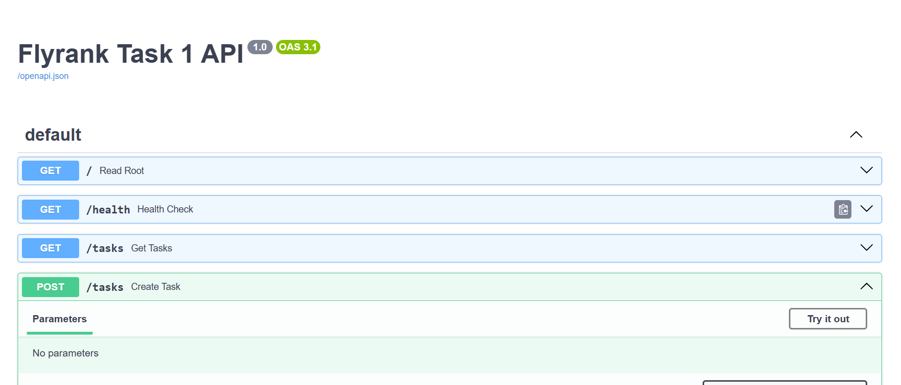
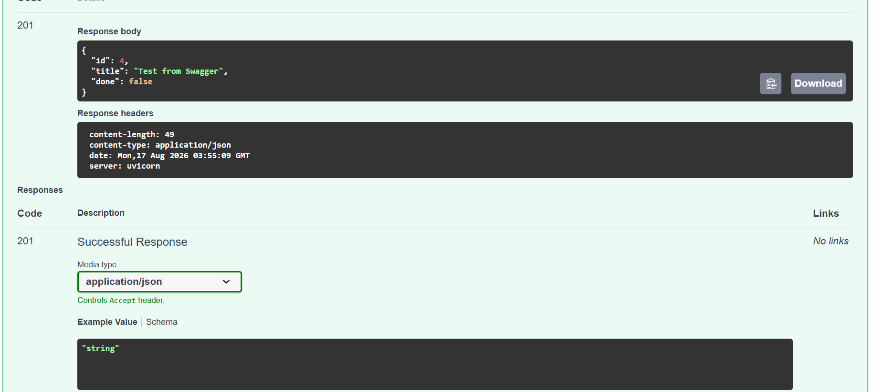

# Task API

A small REST API for managing a to-do list — supports Create, Read, Update, and Delete operations on tasks. Built with Python and FastAPI, with interactive documentation via Swagger UI. Data is stored in memory (resets when the server restarts).

## Setup & Run

1. Clone this repository:
```
   git clone https://github.com/hussaingillani215-sketch/flyrank-week2-crud-api.git
   cd flyrank-week2-crud-api
```

2. Create and activate a virtual environment:

   Windows (PowerShell):
```
   python -m venv venv
   venv\Scripts\Activate.ps1
```

   Mac/Linux:
```
   python3 -m venv venv
   source venv/bin/activate
```

3. Install dependencies:
```
   pip install fastapi uvicorn
```

4. Run the server:
```
   uvicorn main:app --reload
```

5. Visit `http://127.0.0.1:8000/docs` to see the interactive Swagger UI.

## Endpoints

| Method | Path             | Description                          |
|--------|------------------|---------------------------------------|
| GET    | `/`              | API info (name, version, endpoints)  |
| GET    | `/health`        | Health check                          |
| GET    | `/tasks`         | List all tasks                        |
| GET    | `/tasks/{id}`    | Get a single task by id               |
| POST   | `/tasks`         | Create a new task                     |
| PUT    | `/tasks/{id}`    | Update a task's title and/or done     |
| DELETE | `/tasks/{id}`    | Delete a task                         |

## Example request

```
curl -i -X POST http://127.0.0.1:8000/tasks -H "Content-Type: application/json" -d "@body.json"
```

```
HTTP/1.1 201 Created
content-type: application/json

{"id":4,"title":"Buy milk","done":false}
```

## Swagger UI

Full endpoint list:



Live test — creating a task via "Try it out":




## AI vs me

**Prompt used** (written from memory, without looking at the assignment doc):

> Build a REST API for managing tasks, using Python and FastAPI.
>
> Each task has three fields: an id (a number), a title (text), and a done field (true or false, showing whether it's completed).
>
> The API needs these endpoints: a health check endpoint that confirms the server is running, an endpoint to get the full list of tasks, an endpoint to get a single task by its id, an endpoint to create a new task, an endpoint to update an existing task's title and/or done status, and an endpoint to delete a task.
>
> Use these status codes: 201 when a task is successfully created, 404 with a JSON error message when a requested task id doesn't exist, 400 when a title is missing or empty, and 204 with no response body when a task is successfully deleted.
>
> Tasks should be stored in memory, using a plain Python list — not a file or a database. This means all data resets to the 3 example tasks whenever the server restarts.
>
> Since this is built with FastAPI, Swagger UI documentation should appear automatically at /docs with no extra setup or packages required.

**What the AI did better:** my `next_id` logic (`max(...) + 1`) would crash if every task were ever deleted, since `max()` fails on an empty list. The AI's version added a safe fallback (`max(..., default=0) + 1`), which keeps working even if the list is emptied.

**What it got wrong or added beyond my prompt:** my prompt never said whether a client could set `done` when *creating* a task. My own hand-built code always forces `done: False` on create, ignoring anything the client sends. The AI's version silently added a `done` field to task creation, letting a client create a task that's already marked done — something my prompt never actually authorized.

**What my prompt forgot to specify:** I never mentioned the root `GET /` endpoint at all. Sure enough, the AI's code doesn't have one — `curl -i http://127.0.0.1:8001/` returns `404 Not Found`, while my own API returns a JSON description at that same path. The AI didn't guess at something I didn't ask for; it just didn't build it, which is the correct behavior — it exposed a real gap in my spec, not a mistake on its part.

**One-sentence rematch note:** adding "also include a `GET /` endpoint returning basic API info like name and version" to the prompt would close this gap in a regenerated version.
## Stage 4 - Exploring SQLite

Ran DELETE FROM tasks WHERE done = 1; by hand in DB Browser for SQLite. Since a prior UPDATE had just set every row's done to 1, this deleted all 4 rows - and GET /tasks on the still-running server (no restart) immediately returned an empty list, confirming the API and DB Browser read the same file directly, with no syncing step between them.
